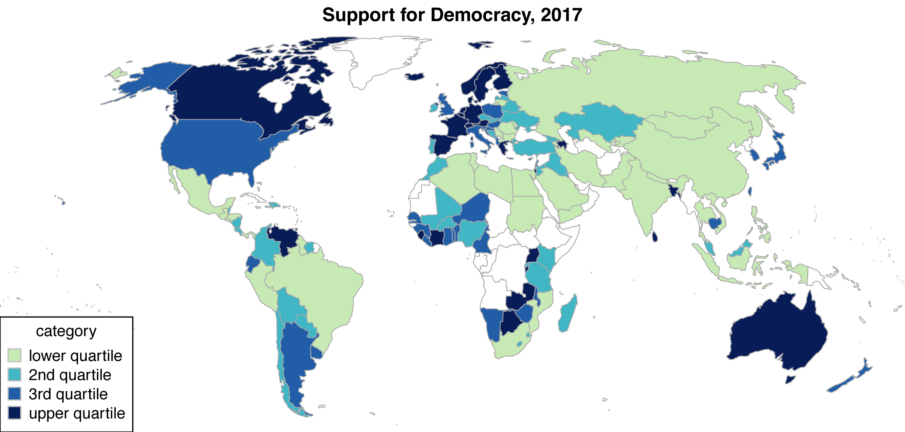

 

### Democratic Mood

Democratic mood measures the extent to which the public of a given country supports a democratic political system and opposes any autocratic alternatives. In contrast to satisfaction with democracy, democratic mood captures principled support for democracy. It is measured by applying a Baysian latent variable model to aggregated survey data from a wide variety of cross-national survey projects, covering over 100 countries and up to 30 years each. 

The Bayesian model is developed and described in a [_Political Analysis_ article](http://doi.org/10.1017/pan.2018.32) (ungated version [here](docs/Claassen_estimating_opinion_panels.pdf)). The mood estimates are extended and applied in two further articles in the [_American Journal of Political Science_](https://doi.org/10.1111/ajps.12452) ([ungated](docs/Claassen_democracy_public_support.pdf)) and [_American Political Science Review_](https://doi.org/10.1017/S0003055419000558) ([ungated](docs/Claassen_democratic_mood.pdf)). The latter includes plots of all national mood time-series. A plot of democratic mood in 2017 is below 

The supplementary materials for both articles provide full details on the exact survey items which were included -- as well as those which were excluded -- the coding scheme applied to aggregate the micro data, and the public opinion projects which fielded these surveys (see, e.g., [here](docs/Democratic_mood_supp_materials.pdf)). 

The democratic mood estimates are available in [this dataset](docs/Dem_mood_v2.csv), provided in CSV format. The estimates span from 1988 (in a few cases) to 2017 (for all 137 cases). The dataset includes the following variables:

* Country -- country name
* Year -- the year of observation
* ISO_code -- a three digit country code
* Dem_mood -- point estimates of democratic mood for each country and year
* N_response -- the number of (aggregated) survey items available for that country and year
* X1 through X100 -- 100 random draws from the posterior density of democratic mood, for users interested in capturing the uncertainty of estimation.

 

### The Alexandra Xenophobia Survey

The Alexandra Xenophobia Survey was conducted in 2011 in Alexandra, in Johannesburg, South Africa. Alexandra has seen a fair amount of anti-immigrant violence, most notably in 2008. The survey focused on measuring respondents' perceptions of, emotional reactions to, and inclinations to take part in violence against immigrants. The sample is a representative sample of 497 South African residents of Alexandra. These data were used in two articles, published in the [_British Journal of Political Science_](http://dx.doi.org/10.1017/S000712341400012X) and [_Research & Politics_](http://dx.doi.org/10.1177/2053168014534649). The data are available [here](docs/alexandra_xenophobia_data.csv).

  

<noscript>

</noscript>

