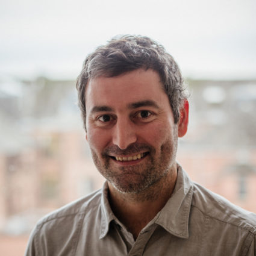

---
---

<link rel="stylesheet" href="styles.css" type="text/css">

I am a political scientist who researches public attitudes to democracy and majority group attitudes to immigrant and ethnic out-groups. I have a particular interest in how these opinions shape political institutions and political behaviour. I also conduct research in quantitative methodology, with a focus on extracting aggregate quantities of interest from secondary survey data. 

I am currently a senior lecturer in politics in the [School of Social and Political Sciences](http://www.gla.ac.uk/schools/socialpolitical/), University of Glasgow, where I teach courses in intergroup conflict and reconciliation, democratisation, and comparative politics. Originally from Durban, South Africa, I completed my PhD in the [Department of  Political Science](https://polisci.wustl.edu/) at Washington University in St. Louis, Missouri.

My CV is available [here](docs/Claassen_CV_full.pdf).